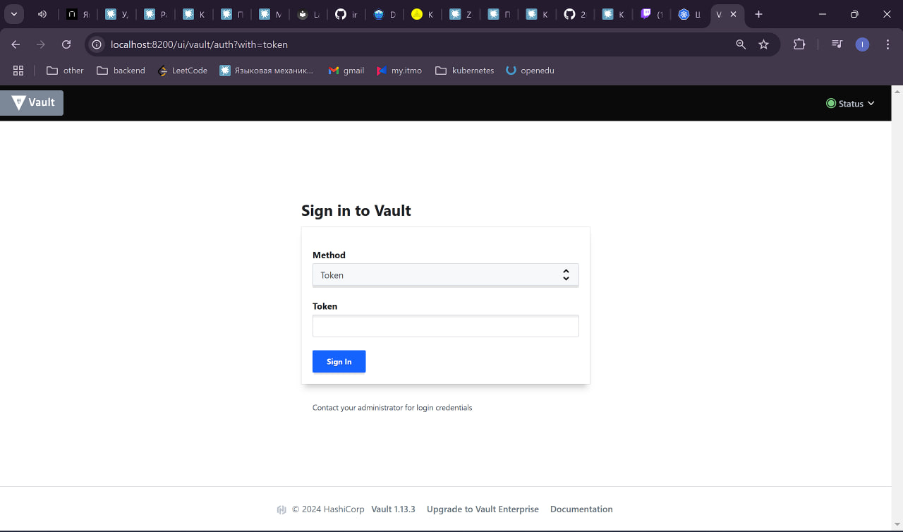
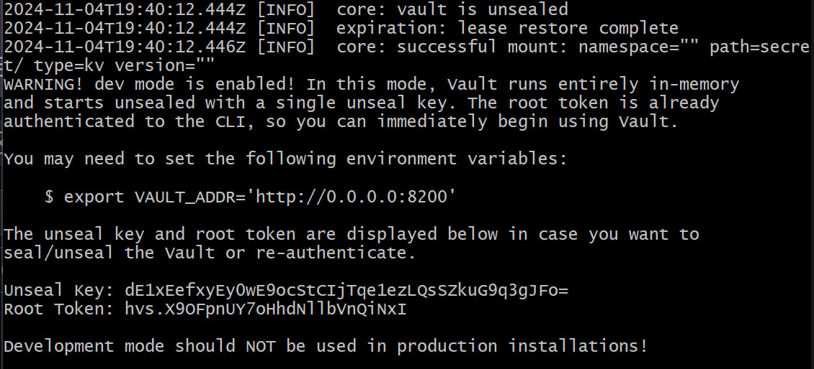
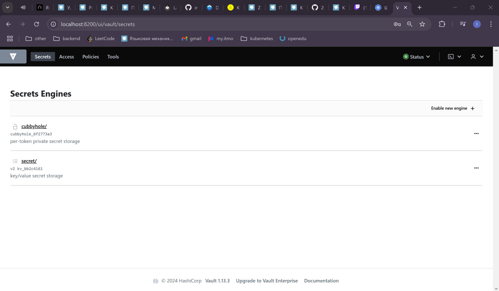
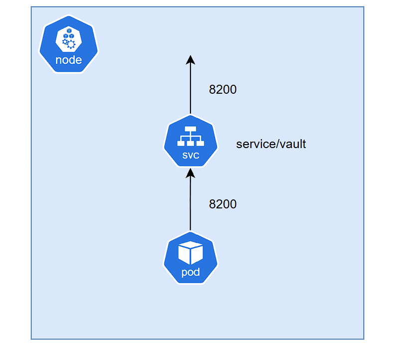

University: [ITMO University](https://itmo.ru/ru/)  
Faculty: [FICT](https://fict.itmo.ru)  
Course: [Introduction to distributed technologies](https://github.com/itmo-ict-faculty/introduction-to-distributed-technologies)  
Year: 2024/2025  
Group: K4110c  
Author: Veselov Ilya Pavlovich 
Lab: Lab1
Date of create: 03.11.2024  
Date of finished:
---
## Ход работы
1. Развернём кластер minikube
```bash
minikube start
```

2. Напишем [манифест](vault-pod.yaml) для пода

3. Применим написанный манифест
```bash
kubectl apply -f vault-pod.yaml
```

4. Создадим сервис типа NodePort
```bash
minikube kubectl -- expose pod vault --type=NodePort --port=8200
```

5. Пробросим порт 8200 при помощи port-forward
```bash
minikube kubectl -- port-forward service/vault 8200:8200
```

6. Попробуем зайти на наш под из браузера


7. Для поиска токена просмотрим логи пода
```bash
kubectl logs vault
```


8. Применим найденный токен и зайдем в vault


9. Составим схему


