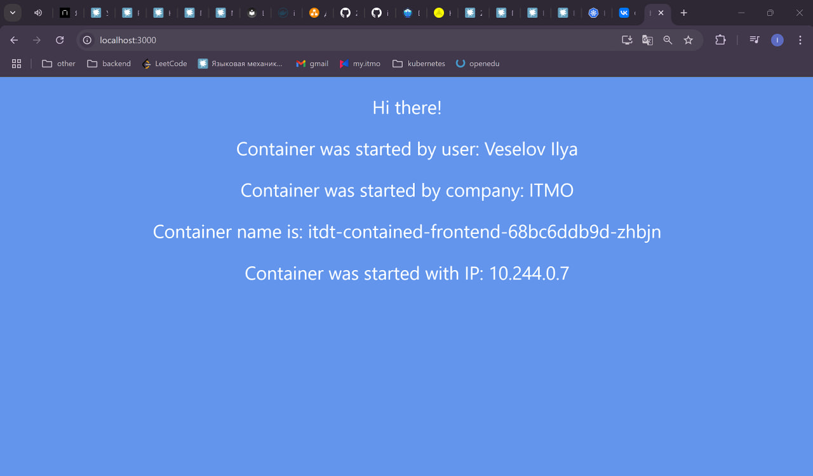
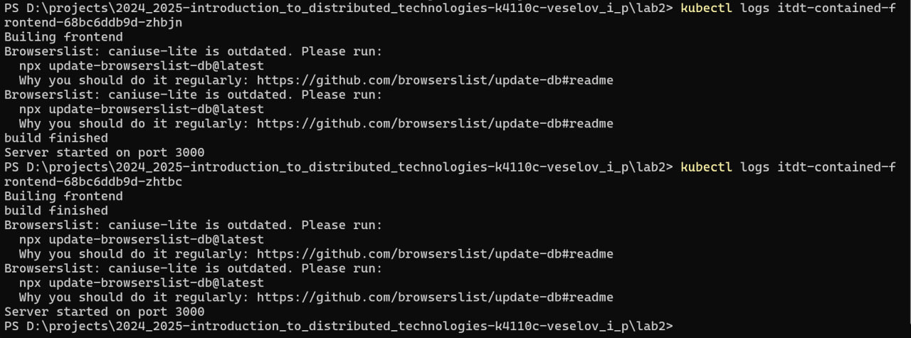
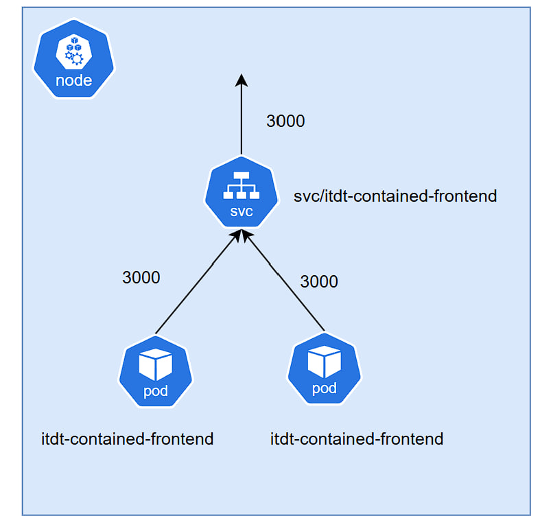

University: [ITMO University](https://itmo.ru/ru/)  
Faculty: [FICT](https://fict.itmo.ru)  
Course: [Introduction to distributed technologies](https://github.com/itmo-ict-faculty/introduction-to-distributed-technologies)    
Year: 2024/2025  
Group: K4110c  
Author: Veselov Ilya Pavlovich 
Lab: Lab2  
Date of create: 04.11.2024  
Date of finished:  
---

1. Напишем манифесты [Deployment](itdt-front-deployment.yml) и [Service](itdt-front-svc.yml)

2. Применим их
```bash
kubectl apply -f .
```

3. После полного запуска подов пробросим порт
```bash
minikube kubectl -- port-forward service/itdt-contained-frontend 3000:3000
```

4. Зайдем через браузер на сервис


5. Посмотрим логи реплик


6. Нарисуем схему

