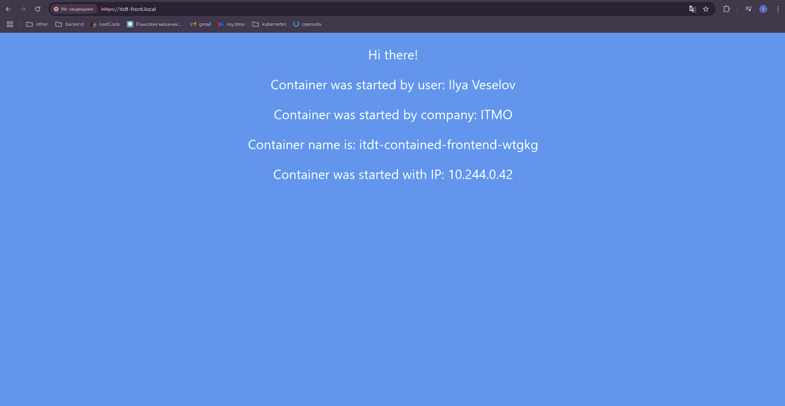

University: [ITMO University](https://itmo.ru/ru/)  
Faculty: [FICT](https://fict.itmo.ru)  
Course: [Introduction to distributed technologies](https://github.com/itmo-ict-faculty/introduction-to-distributed-technologies)  
Year: 2024/2025  
Group: K4110c  
Author: Veselov Ilya Pavlovich
Lab: Lab3  
Date of create: 26.11.2024   
Date of finished:  
---

1. Создадим [configMan](itdt-front-configmap.yaml) c переменными REACT_APP_USERNAME, REACT_APP_COMPANY_NAME

2. Создадим [replicaSet](itdt-front-replicaset.yaml) с 2 репликами. В spec добавим ранее созданный configMap
```yaml
envFrom:
    - configMapRef:
        name: itdt-frontend
```

3. Включим аддон ingress 
```bash 
minikube -p itdt-k8s addons enable ingress
```

4. Создаем сертификаты командой, где при помощи -x509 укажем, что подпишем сертификат сами
```bash
openssl req -x509 -days 1000 -nodes -newkey rsa:2048 -keyout itdt-front.local.key -out itdt-front.local.crt -subj "/CN=itdt-front.local"
```


5. Создадим secret при помощи команды
```bash
kubectl create secret tls itdt-contained-frontend-certs --cert=itdt-front.local.crt --key=itdt-front.local.key
```


6. Создадим [ClusterIP](itdt-front-svc.yaml) сервис. Используем его, т.к. он предоставляет доступ к поду внутри кластера. Внешние запросы будет принимать ingress и потом отправлять внутри кластера на наш ClusterIP

7. Создаем [Ingress](itdt-front-ingress.yml), где укажем наш домен `itdt-front.local` и название секрета

8. Применим все созданные манифесты
```bash
kubectl apply -f .
```

9. Добавляем в `C:\Windows\system32\drivers\etc\hosts` запись с localhost и наш FQDN


10. Для доступа к ingress используем tunnel
```bash 
minikube tunnel
```

11. Войдем в веб приложение по нашему FQDN используя HTTPS. Сертификат есть


12. Просмотрим сам сертификат


13. Построим схему. Клиент заходим по нашему FQDN, попадая на Ingress, который работает как прокси от внешнего источника до сервиса внутри нашего кластера. При попадании на ClusterIP происходит перенаправление на один из наших подов, созданных при помощи replicaSet

