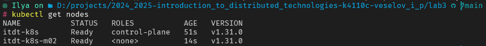
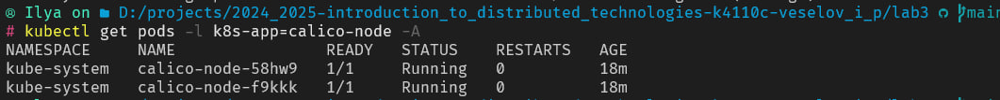
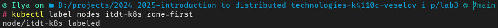
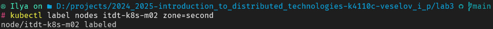
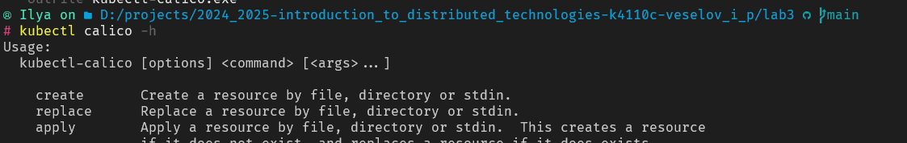
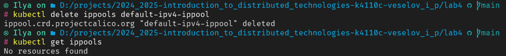
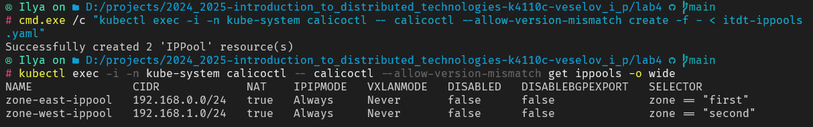
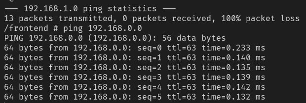

University: [ITMO University](https://itmo.ru/ru/)  
Faculty: [FICT](https://fict.itmo.ru)  
Course: [Introduction to distributed technologies](https://github.com/itmo-ict-faculty/introduction-to-distributed-technologies)  
Year: 2024/2025  
Group: K4110c  
Author: Veselov Ilya Pavlovich
Lab: Lab3  
Date of create: 26.11.2024   
Date of finished:  
---

1. Запустим minikube вместе в calico. Также развернем 2 ноды
```bash
minikube start --network-plugin=cni --cni=calico --nodes 2 -p itdt-k8s
```

2. Проверим ноды


3. Проверим работу CNI Calico


4. Создадим [ippool](itdt-ippools.yaml) и добавим label к нодам
```bash
kubectl label nodes itdt-k8s zone=first 
kubectl label nodes itdt-k8s-m02 zone=second
```



5. По инструкции установим calicoctl и проверим работу плагина


6. Получаем список ippool-ов и удалим дефолтный
```bash
kubectl exec -i -n kube-system calicoctl -- calicoctl --allow-version-mismatch get ippools -o wide
```


7. Добавляем созданные нами IPPool-ы
```powershell
cmd.exe /c "kubectl exec -i -n kube-system calicoctl -- calicoctl --allow-version-mismatch create -f - < itdt-ippools.yaml"
```


8. Деплоим приложение

9. проверим командой ping, что всё работает



